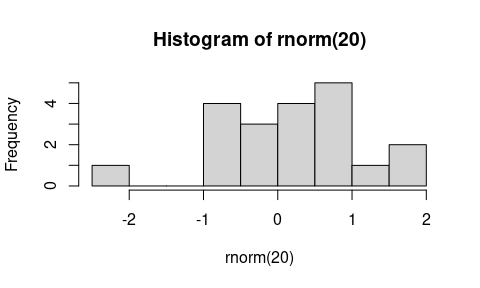

# 1) How to generate a document from this file

From within R, you can run the document through the either the
*rmarkdown* or *knitr* package for R to generate an html file, or
through the *rmarkdown* package to generate PDF or Word (the latter
being useful at times but hopefully avoidable).

Alternatively, start R and run the desired line from amongst following
in R:

``` r
library(rmarkdown); render('demo.Rmd', 'pdf_document')
library(rmarkdown); render('demo.Rmd', 'html_document')
library(rmarkdown); render('demo.Rmd', 'word_document')
library(knitr); knit2html('demo.Rmd')  
```

Or in RStudio, click on the ‘Knit’ pull-down menu and choose to knit to
HTML, PDF, or Word (for R Markdown).

Alternatively, from the UNIX command line, run one of these:

``` bash
Rscript -e "library(rmarkdown); render('demo.Rmd', 'pdf_document')"  # PDF
Rscript -e "library(rmarkdown); render('demo.Rmd', 'html_document')"  # HTML
Rscript -e "library(rmarkdown); render('demo.Rmd', 'word_document')"  # Word
Rscript -e "library(knitr); knit2html('demo.Rmd')"  # HTML alternative
```

# 2) Some basic Markdown formatting

Here’s an *introduction* to our **critical** discovery. Here we have
some code to display inline but not evaluate: `exp(7)` and we can embed
the code in a static code block as follows:

    a = 7 %% 5
    b = exp(a)

This document will focus on embedding math and code and not on standard
Markdown formatting. There are lots of sources of information on
Markdown. [RStudio has good information on R
Markdown](https://rmarkdown.rstudio.com) (including Markdown
formatting).

For documents whose output format is HTML, you can use HTML formatting
within your Markdown-based text.

# 3) Embedding equations using LaTeX

This can be done with the following syntax. Note that you can’t have a
space after the initial $ for the inline equations.

Here is an inline equation *f*(*x*) = ∫*f*(*y*,*x*)*d**y*.

Here’s a displayed equation

*f*<sub>*θ*</sub>(*x*) = ∫*f*<sub>*θ*</sub>(*y*,*x*)*d**y*.

# 4) Embedding R code

Here’s an R code chunk

``` r
a <- c(7, 3)
mean(a)
```

    ## [1] 5

``` r
b <- a + 3
mean(b)
```

    ## [1] 8

Here’s another chunk:

``` r
mean(b)
```

    ## [1] 8

When running R code, output is printed interspersed with the code, as
one would generally want. Also, later chunks have access to result from
earlier chunks (i.e., state is preserved between chunks).

Let’s make a plot:

``` r
hist(rnorm(20))
```

<!-- -->

And here’s some inline R code: What is 3 plus 5? 8.

You have control over whether code in chunks is echoed into the document
and evaluated using the `include`, `echo`, and `eval` tags.

    ## This code is not printed in the document, but results of evaluating the code are printed.

``` r
cat("This code is not evaluated, but the code itself is printed in the document.")
```

Results of intensive calculations can be saved using the `cache=TRUE`
tag so they don’t need to be rerun every time you compile the document.

``` r
a <- mean(rnorm(5e7))
a
```

    ## [1] 8.562798e-05

You can use R variables to control the chunk options. Note that the
variable `myControlVar` is defined in the first chunk of this document.

``` r
print("hi")
```

An alternative, nice way to specify chunk options is within the chunk,
like this:

``` r
cat("This code is printed in the document, but the code is not evaluated.")
```

# 5) Embedding bash and Python code

## 5.1) bash

A bash chunk:

``` bash
ls -l
df -h
cd /tmp
pwd
```

    ## total 3040
    ## drwxr-sr-x 6 paciorek scfstaff      6 Nov 17  2021 assets
    ## drwxr-sr-x 2 paciorek scfstaff     10 Feb  1  2022 cache
    ## -rw-r--r-- 1 paciorek scfstaff    394 Feb  3  2022 _config.yml
    ## -rw-r--r-- 1 paciorek scfstaff 282459 Feb  2  2022 demo-bash.html
    ## -rw-r--r-- 1 paciorek scfstaff   8083 Feb  2  2022 demo-bash.ipynb
    ## -rw-r--r-- 1 paciorek scfstaff  48673 Feb  2  2022 demo-bash.pdf
    ## drwxr-sr-x 7 paciorek scfstaff      7 Aug 31 17:19 demo_cache
    ## -rw-r--r-- 1 paciorek scfstaff  22979 Feb  3  2022 demo.docx
    ## drwxr-sr-x 7 paciorek scfstaff      7 Aug 31 17:19 demo_files
    ## -rw-r--r-- 1 paciorek scfstaff 660439 Feb  3  2022 demo.html
    ## -rw-r--r-- 1 paciorek scfstaff  24939 Feb  1  2022 demo.lyx
    ## -rw-r--r-- 1 paciorek scfstaff 259113 Aug 18 14:29 demo.pdf
    ## -rw-r--r-- 1 paciorek scfstaff 284419 Feb  2  2022 demo-python.html
    ## -rw-r--r-- 1 paciorek scfstaff   6936 Feb  2  2022 demo-python.ipynb
    ## -rw-r--r-- 1 paciorek scfstaff  49626 Feb  2  2022 demo-python.pdf
    ## -rw-r--r-- 1 paciorek scfstaff   3662 Jan 27  2022 demo-python.qmd
    ## -rw-r--r-- 1 paciorek scfstaff  13224 Aug 18 14:30 demo.qmd
    ## -rw-r--r-- 1 paciorek scfstaff  13004 Aug 18 12:56 demo.qmd~
    ## -rw-r--r-- 1 paciorek scfstaff    252 Jan 31  2022 demo.R
    ## -rw-r--r-- 1 paciorek scfstaff 321394 Feb  2  2022 demo-R.html
    ## -rw-r--r-- 1 paciorek scfstaff 124604 Feb  2  2022 demo-R.ipynb
    ## -rw-r--r-- 1 paciorek scfstaff  13004 Feb  2  2022 demo.Rmd
    ## -rw-r--r-- 1 paciorek scfstaff  10853 Nov  6  2019 demo.Rmd.save
    ## -rw-r--r-- 1 paciorek scfstaff  12462 Feb  1  2022 demo.Rnw
    ## -rw-r--r-- 1 paciorek scfstaff  59736 Feb  2  2022 demo-R.pdf
    ## -rw-r--r-- 1 paciorek scfstaff  12890 Feb  1  2022 demo.Rtex
    ## drwxr-sr-x 2 paciorek scfstaff      5 Jul 30  2015 figure
    ## drwxr-sr-x 2 paciorek scfstaff      3 Jul  5 16:07 _includes
    ## -rw-r--r-- 1 paciorek scfstaff   7696 Aug 18 14:31 index.md
    ## drwxr-sr-x 2 paciorek scfstaff      4 Jul  5 16:07 _layouts
    ## -rw-r--r-- 1 paciorek scfstaff    463 Jul  5 16:52 Makefile
    ## -rw-r--r-- 1 paciorek scfstaff   2129 Jul  5 16:34 python-in-RStudio.md
    ## -rw-r--r-- 1 paciorek scfstaff 171796 Feb  2  2022 python-in-RStudio.pdf
    ## -rw-r--r-- 1 paciorek scfstaff   2055 Jul  5 16:09 python-in-RStudio.Rmd
    ## -rw-r--r-- 1 paciorek scfstaff    773 Feb  3  2022 README.md
    ## -rw-r--r-- 1 paciorek scfstaff  14902 Jul 30  2015 refs.bib
    ## drwxr-sr-x 2 paciorek scfstaff      7 Aug 31 15:58 _sass
    ## -rw-r--r-- 1 paciorek scfstaff   7167 Jul 17  2015 test-line-formatting.Rnw
    ## -rw-r--r-- 1 paciorek scfstaff    390 Aug 18 14:28 tmp.txt
    ## Filesystem                       Size  Used Avail Use% Mounted on
    ## /dev/sda2                        2.7T  177G  2.4T   7% /
    ## udev                              16G     0   16G   0% /dev
    ## tmpfs                             16G  327M   16G   3% /dev/shm
    ## tmpfs                            3.2G  7.5M  3.2G   1% /run
    ## tmpfs                            5.0M  4.0K  5.0M   1% /run/lock
    ## tmpfs                             16G     0   16G   0% /sys/fs/cgroup
    ## /dev/sda1                        511M  5.3M  506M   2% /boot/efi
    ## /dev/sdb1                        111G  622M  105G   1% /tmp
    ## oz.berkeley.edu:/pool0/system    6.0T  4.1T  2.0T  68% /system
    ## oz.berkeley.edu:/pool0/accounts   72T  7.3T   64T  11% /accounts
    ## tmpfs                            3.2G  124K  3.2G   1% /run/user/3189
    ## oz.berkeley.edu:/pool0/scratch    30T   23T  7.7T  75% /scratch
    ## /tmp

Unfortunately, output from bash chunks occurs after all the code is
printed. Also, state is not preserved between chunks.

We can see that state is not preserved here, where the current working
directory is NOT the directory that we changed to in the chunk above.

``` bash
pwd  # result would be /tmp if state were preserved 
```

    ## /accounts/vis/paciorek/staff/tutorials/tutorial-dynamic-docs

Inline bash code won’t work: `bash wc demo.Rmd`, unlike with R code.

## 5.2) Embedding Python code

You can embed Python code. As with R, state is preserved so later chunks
can use objects from earlier chunks.

``` python
import numpy as np
x = np.array((3, 5, 7))
print(x.sum())
```

    ## 15

``` python
x.min()    # this will print with more recent versions of rmarkdown 
```

    ## 3

``` python
try:
        print(x[0])
except NameError:
       print('state is not preserved: x does not exist')
```

    ## 3

There is no facility for inline Python code: `python print(3+5)`

# 6) Reading code from an external file

It’s sometimes nice to draw code in from a separate file. Before
invoking a chunk, we need to read the chunks from the source file, which
contains the chunks tagged with some special formatting. Note that a
good place for reading the source file via `read_chunk()` is in an
initial setup chunk at the beginning of the document.

``` r
a <- 7
cat("a is ", a, ".\n", sep = "")
```

    ## a is 7.

``` r
a <- 9
cat("Now, a is ", a, ".\n", sep = "")
```

    ## Now, a is 9.

# 7) Formatting of long lines of code and of output

## 7.1) R code

Having long lines be nicely formatted and other aspects of formatting
can be a challenge. Also, results can differ depending on your output
format (e.g., PDF vs. HTML). In general the code in this section will
often overflow the page width in PDF but not in HTML, but even in the
HTML the line breaks may be awkwardly positioned.

Here are some examples that overflow in PDF output.

``` r
b <- "Statistics at UC Berkeley: We are a community engaged in research and education in probability and statistics. In addition to developing fundamental theory and methodology, we are actively"
## Statistics at UC Berkeley: We are a community engaged in research and education in probability and statistics. In addition to developing fundamental theory and methodology, we are actively

## This should work to give decent formatting in HTML but doesn't in PDF.
cat(b, fill = TRUE)
```

    ## Statistics at UC Berkeley: We are a community engaged in research and education in probability and statistics. In addition to developing fundamental theory and methodology, we are actively

``` r
vecWithALongName = rnorm(100)
a = length(mean(5 * vecWithALongName + vecWithALongName - exp(vecWithALongName) + vecWithALongName * vecWithALongName, na.rm = TRUE))
a = length(mean(5 * vecWithALongName + vecWithALongName)) # this is a comment that goes over the line by a good long ways
a = length(mean(5 * vecWithALongName + vecWithALongName - exp(vecWithALongName) + vecWithALongName, na.rm = TRUE)) # this is a comment that goes over the line by a good long long long long long long long long ways
```

In contrast, long output is usually fine, even in PDF.

``` r
rnorm(30)
```

    ##  [1]  0.47485053 -0.53300834 -0.69385985 -1.30288852 -1.14076964 -1.04437702
    ##  [7]  0.51995461  0.15155954  0.55836893 -1.87940055 -0.99908618 -0.47083913
    ## [13]  0.88461719 -2.47235000  1.55333948  1.41114869  1.91056609 -0.62932679
    ## [19]  1.22380063  1.12960580 -0.84659648 -0.65229492  1.83760743 -1.32678114
    ## [25]  0.50964439 -0.80747544 -0.03085863 -0.91200119  0.82473210  0.70518136

Adding the `tidy=TRUE` chunk option and setting the width (as shown in
the Rmd version of this document) can help with long comment lines or
lines of code, but doesn’t help for some of the cases above.

``` r
## Long strings and long comments:

b <- "Statistics at UC Berkeley: We are a community engaged in research and education in probability and statistics. In addition to developing fundamental theory and methodology, we are actively"
## Statistics at UC Berkeley: We are a community engaged in research and
## education in probability and statistics. In addition to developing
## fundamental theory and methodology, we are actively

## This should work to give decent formatting in HTML but doesn't in PDF:

cat(b, fill = TRUE)
```

    ## Statistics at UC Berkeley: We are a community engaged in research and education in probability and statistics. In addition to developing fundamental theory and methodology, we are actively

``` r
## Now consider long lines of code:

vecWithALongName <- rnorm(100)
a <- length(mean(5 * vecWithALongName + vecWithALongName - exp(vecWithALongName) +
    vecWithALongName * vecWithALongName, na.rm = TRUE))
a <- length(mean(5 * vecWithALongName + vecWithALongName))  # this is a comment that goes over the line by a good long ways
a <- length(mean(5 * vecWithALongName + vecWithALongName - exp(vecWithALongName) +
    vecWithALongName, na.rm = TRUE))  # this is a comment that goes over the line by a good long long long long long long long long ways
```

To address the problems seen above, sometimes you can format things
manually for better results. You may need to tag the chunk with
`tidy=FALSE`, but I have not done that here.

``` r
## Breaking up a string:

b <- "Statistics at UC Berkeley: We are a community engaged in research
 and education in probability and statistics. In addition to developing 
fundamental theory and methodology, we are actively"

## Breaking up a comment:

## Statistics at UC Berkeley: We are a community engaged in research and 
## education in probability and statistics. In addition to developing 
## fundamental theory and methodology, we are actively

## Breaking up code lines:

vecWithALongName = rnorm(100)
a <- length(mean(5 * vecWithALongName + vecWithALongName - exp(vecWithALongName) + 
    vecWithALongName * vecWithALongName, na.rm = TRUE))
a <- length(mean(5 * vecWithALongName + vecWithALongName)) # this is a comment that 
    ## goes over the line by a good long ways
a <- length(mean(5 * vecWithALongName + vecWithALongName - exp(vecWithALongName) + 
    vecWithALongName, na.rm = TRUE)) # this is a comment that goes over the line 
    ## by a good long long long long long long long long ways
```

## 7.2) bash code

In bash, we have similar problems with lines overflowing in PDF output,
but bash allows us to use a backslash to break lines of code. However
that strategy doesn’t help with long lines of output.

``` bash
echo "Statistics at UC Berkeley: We are a community engaged in research and education in probability and statistics. In addition to developing fundamental theory and methodology, we are actively" > tmp.txt
  
echo "Second try: Statistics at UC Berkeley: We are a community engaged \
in research and education in probability and statistics. In addition to \
developing fundamental theory and methodology, we are actively" \
>> tmp.txt

cat tmp.txt
```

    ## Statistics at UC Berkeley: We are a community engaged in research and education in probability and statistics. In addition to developing fundamental theory and methodology, we are actively
    ## Second try: Statistics at UC Berkeley: We are a community engaged in research and education in probability and statistics. In addition to developing fundamental theory and methodology, we are actively

We also have problems with long comments, so we would need to manually
format them.

Here is a long comment line that overflows in PDF:

``` bash
# asdl lkjsdf jklsdf kladfj jksfd alkfd klasdf klad kla lakjsdf aljdkfad kljafda kaljdf afdlkja lkajdfsa lajdfa adlfjaf jkladf afdl
```

Instead manually break the comment into multiple lines:

``` bash
# asdl lkjsdf jklsdf kladfj jksfd alkfd klasdf klad kla 
# lakjsdf aljdkfad kljafda kaljdf afdlkja lkajdfsa lajdfa 
# adlfjaf jkladf afdl
```

## 7.3) Python code

In Python, there is similar trouble with lines overflowing in PDF output
too.

``` python
# This overflows the page:

b = "asdl lkjsdf jklsdf kladfj jksfd alkfd klasdf klad kla lakjsdf aljdkfad kljafda kaljdf afdlkja lkajdfsa lajdfa adlfjaf jkladf afdl"
print(b)
```

    ## asdl lkjsdf jklsdf kladfj jksfd alkfd klasdf klad kla lakjsdf aljdkfad kljafda kaljdf afdlkja lkajdfsa lajdfa adlfjaf jkladf afdl

``` python
# This code overflows the page:

zoo = {"lion": "Simba", "panda": None, "whale": "Moby", "numAnimals": 3, "bear": "Yogi", "killer whale": "shamu", "bunny:": "bugs"}
print(zoo)
```

    ## {'lion': 'Simba', 'panda': None, 'whale': 'Moby', 'numAnimals': 3, 'bear': 'Yogi', 'killer whale': 'shamu', 'bunny:': 'bugs'}

To fix the issue, we can manually break the code into multiple lines,
but long output still overflows.

``` python
zoo = {"lion": "Simba", "panda": None, "whale": "Moby", 
       "numAnimals": 3, "bear": "Yogi", "killer whale": "shamu", 
       "bunny:": "bugs"}
print(zoo)
```

    ## {'lion': 'Simba', 'panda': None, 'whale': 'Moby', 'numAnimals': 3, 'bear': 'Yogi', 'killer whale': 'shamu', 'bunny:': 'bugs'}

Long comments overflow as well, but you can always manually break into
multiple lines.

``` python
# asdl lkjsdf jklsdf kladfj jksfd alkfd klasdf klad kla lakjsdf aljdkfad kljafda kaljdf afdlkja lkajdfsa lajdfa adlfjaf jkladf afdl

# asdl lkjsdf jklsdf kladfj jksfd alkfd klasdf klad kla lakjsdf aljdkfad
# kljafda kaljdf afdlkja lkajdfsa lajdfa adlfjaf jkladf afdl
```

# 8) References

We’ll just see how you use BibTeX style references. Banerjee et al.
(2008) proposed a useful method. This was confirmed (Cressie and
Johannesson 2008).

Note the indication of the `refs.bib` file in the initial lines of this
document so that the bibliographic information for these citations can
be found.

The list of references is placed at the end of the document. You’d
presumably want a section header like this:

# Literature cited

<div id="refs" class="references csl-bib-body hanging-indent">

<div id="ref-Bane:etal:2008" class="csl-entry">

Banerjee, S., A. E. Gelfand, A. O. Finley, and H. Sang. 2008. “Gaussian
Predictive Process Models for Large Spatial Data Sets.” *Journal of the
Royal Statistical Society B* 70 (4): 825–48.

</div>

<div id="ref-Cres:Joha:2008" class="csl-entry">

Cressie, N., and G. Johannesson. 2008. “Fixed Rank Kriging for Very
Large Spatial Data Sets.” *Journal of the Royal Statistical Society B*
70 (1): 209–26.

</div>

</div>
